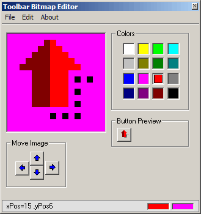



## My Toolbar Bitmap Editor

### Description

Hi This is a small Pixel editor I made for my self to make small toolbar 16x16 bitmaps, it like the ones you see in word when you edit a menu button, anyway mine allows you to invert color, flip and rotate the image, Move the image, anyway hope you like it.
 
### More Info
 

             |
---                |---
**Submitted On**   |2007-05-09 00:41:30
**By**             |[dreamvb](https://github.com/Planet-Source-Code/PSCIndex/blob/master/ByAuthor/dreamvb.md)
**Level**          |Beginner
**User Rating**    |5.0 (15 globes from 3 users)
**Compatibility**  |VB 6\.0
**Category**       |[Graphics](https://github.com/Planet-Source-Code/PSCIndex/blob/master/ByCategory/graphics__1-46.md)
**World**          |[Visual Basic](https://github.com/Planet-Source-Code/PSCIndex/blob/master/ByWorld/visual-basic.md)
**Archive File**   |[My\_Toolbar206483592007\.zip](https://github.com/Planet-Source-Code/dreamvb-my-toolbar-bitmap-editor__1-68550/archive/master.zip)

